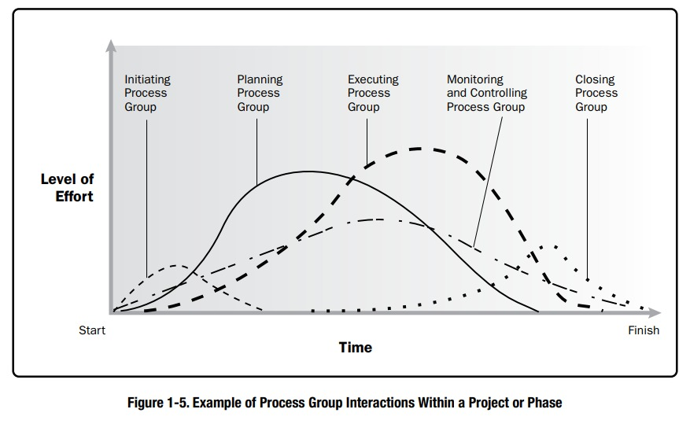

# Project Management Process Groups

This standard outlines the project management processes used to achieve project objectives. These processes are categorized into five Project Management Process Groups:

## Initiating Process Group
The processes involved in defining a new project or a new phase of an existing project. These processes obtain authorization to initiate the project or phase. Initiating processes are covered in Section 2.

## Planning Process Group
Processes needed to determine the project's scope, refine objectives, and establish the necessary actions to accomplish project goals. Covered in Section 3.

## Executing Process Group
Processes executed to fulfill the tasks outlined in the project management plan and meet project requirements. Detailed in Section 4.

## Monitoring and Controlling Process Group
Processes required to track, review, and control project progress and performance. These processes identify areas needing plan adjustments and initiate necessary changes. Explored in Section 5.

## Closing Process Group
Processes performed to formally conclude a project, phase, or contract. Described in Section 6.

These Process Groups are independent of application areas (e.g., marketing, information services) or industry focus (e.g., construction, aerospace). Processes within these groups can be iterated before phase or project completion. Processes generally fall into three categories:

1. Processes used once or at specific project points (e.g., project charter development, project closure).
2. Periodic processes performed as needed (e.g., resource acquisition, procurement).
3. Continuous processes throughout the project (e.g., defining activities, ongoing monitoring and control).

The output of one process typically becomes an input for another process or a project deliverable. For instance, project management plans and documents (e.g., risk register, responsibility assignment matrix) from the Planning Process Group feed into the Executing Process Group for updates. 

Process Groups should not be confused with project phases. While interacting within each phase, these groups may also overlap. Project phases (e.g., concept development, design, testing) incorporate processes from all the Process Groups, with iterations as necessary to meet phase completion criteria.

# Initiating Process Group

The Initiating Process Group involves processes that define a new project or phase by obtaining authorization to begin. The goal is to align stakeholders' expectations, inform them about project scope and objectives, and clarify their role in ensuring project success.

In these processes, the initial project scope is defined, along with initial financial commitments. Key stakeholders are identified, and the project manager may be appointed if not already assigned. This information is captured in the project charter and stakeholder register. Upon approval of the project charter, the project is authorized, and the project manager gains the authority to allocate organizational resources.

The main benefits of this Process Group are ensuring that only projects aligned with strategic objectives are authorized, and that business case, benefits, and stakeholders are considered from the project's outset. The project manager's involvement in business case development and benefit definition varies by organization. This standard assumes approval by sponsors or governing bodies after reviewing business documents.

Business documents, originating externally but used in the project, include the business case and benefits management plan. Figure 2-1 illustrates the role of sponsors and business documents in relation to Initiating Processes.

## Develop Project Charter (2.1)

This process involves creating a document that formally authorizes the project's existence and empowers the project manager to allocate organizational resources. Key benefits include linking the project to organizational strategic objectives, creating a formal project record, and demonstrating organizational commitment.

## Identify Stakeholders (2.2)

This process identifies and analyzes project stakeholders, documenting information about their interests, involvement, influence, and impact. It helps the project team engage stakeholders effectively.

### Inputs for this process may include:
- Communications management plan
- Stakeholder engagement plan

### Examples of project documents that could be inputs are:
- Change log
- Issue log
- Requirements documentation

### Project management plan updates may include:
- Requirements management plan
- Communications management plan
- Risk management plan
- Stakeholder engagement plan

### Project document updates may include:
- Assumption log
- Issue log
- Risk register

# Grupo de Procesos de Planificación

El Grupo de Procesos de Planificación consta de los procesos que establecen el alcance total del esfuerzo, definen y 
refinan los objetivos, y desarrollan el curso de acción necesario para alcanzar esos objetivos. Los procesos en el 
Grupo de Procesos de Planificación desarrollan los componentes del plan de gestión del proyecto y los documentos 
del proyecto utilizados para llevar a cabo el proyecto. La naturaleza de un proyecto puede requerir el uso de bucles de 
retroalimentación repetidos para análisis adicional. A medida que se recopila y comprende más información o 
características del proyecto, es probable que se requiera una planificación adicional. Cambios significativos que 
ocurren a lo largo del ciclo de vida del proyecto pueden iniciar la necesidad de revisar uno o más de los procesos de 
planificación y, posiblemente, uno o ambos de los procesos de Iniciación. Esta refinación continua del plan de gestión 
del proyecto se llama elaboración progresiva, indicando que la planificación y documentación son actividades iterativas 
u continuas. El beneficio clave de este Grupo de Procesos es definir el curso de acción para completar con éxito el 
proyecto o la fase.
El equipo de gestión de proyectos busca la aportación y fomenta la participación de las partes interesadas relevantes 
mientras planifica el proyecto y desarrolla el plan de gestión del proyecto y los documentos del proyecto. Cuando el 
esfuerzo de planificación inicial se completa, la versión aprobada del plan de gestión del proyecto se considera una 
línea de base. A lo largo del proyecto, los procesos de Monitoreo y Control comparan el rendimiento del proyecto con 
las líneas de base.

## 3.1 DESARROLLAR EL PLAN DE GESTIÓN DEL PROYECTO

Desarrollar el Plan de Gestión del Proyecto es el proceso de definir, preparar y coordinar todos los componentes del 
plan y consolidarlos en un plan de gestión del proyecto integrado. El beneficio clave de este proceso es la producción 
de un documento integral que define la base de todo el trabajo del proyecto y cómo se realizará el trabajo.

## 3.2 PLANIFICAR LA GESTIÓN DEL ALCANCE

Planificar la Gestión del Alcance es el proceso de crear un plan de gestión del alcance que documenta cómo se 
definirá, validará y controlará el alcance del proyecto y del producto. El beneficio clave de este proceso es proporcionar 
orientación y dirección sobre cómo se gestionará el alcance a lo largo del proyecto.

### Insumos para este proceso pueden incluir:
- Plan de gestión de calidad
- Descripción del ciclo de vida del proyecto
- Enfoque de desarrollo

## 3.3 RECOLECTAR REQUISITOS

Recolectar Requisitos es el proceso de determinar, documentar y gestionar las necesidades y requisitos de las partes 
interesadas para cumplir con los objetivos del proyecto. El beneficio clave de este proceso es establecer la base para 
definir el alcance del producto y del proyecto.

### Insumos para este proceso pueden incluir:
- Plan de gestión de alcance
- Plan de gestión de requisitos
- Plan de participación de las partes interesadas

## 3.3.2 EJEMPLOS DE DOCUMENTOS DEL PROYECTO

Ejemplos de documentos del proyecto que pueden ser insumos para este proceso incluyen, pero no se limitan a:
- Registro de suposiciones
- Registro de lecciones aprendidas
- Registro de partes interesadas.

## 3.4 DEFINIR EL ALCANCE

Definir el Alcance es el proceso de desarrollar una descripción detallada del proyecto y del producto. El beneficio clave 
de este proceso es que describe los límites del producto, servicio o resultado y los criterios de aceptación.

### Componentes del Plan de Gestión del Proyecto que pueden ser insumos para este proceso:
- Plan de gestión de alcance (ejemplo)

### Ejemplos de documentos del proyecto que pueden ser insumos para este proceso incluyen, pero no se limitan a:
- Registro de suposiciones
- Documentación de requisitos
- Registro de riesgos.

### Los documentos del proyecto que pueden actualizarse como resultado de este proceso incluyen, pero no se limitan a:
- Registro de suposiciones
- Documentación de requisitos
- Matriz de trazabilidad de requisitos
- Registro de partes interesadas.

## 3.5 CREAR LA ESTRUCTURA DE DESGLOSE DEL TRABAJO (EDT)

Crear la Estructura de Desglose del Trabajo (EDT) es el proceso de subdividir los entregables del proyecto y el trabajo 
del proyecto en componentes más pequeños y manejables. El beneficio clave de este proceso es que proporciona un 
marco de trabajo de lo que debe entregarse.

### Componentes del Plan de Gestión del Proyecto que pueden ser insumos para este proceso:
- Plan de gestión de alcance (ejemplo)

### Ejemplos de documentos del proyecto que pueden ser insumos para este proceso incluyen, pero no se limitan a:
- Declaración de alcance del proyecto
- Documentación de requisitos.

### Los documentos del proyecto que pueden actualizarse como resultado de este proceso incluyen, pero no se limitan a:
- Registro de suposiciones
- Documentación de requisitos.

## 3.6 PLANIFICAR LA GESTIÓN DEL CRONOGRAMA

Planificar la Gestión del Cronograma es el proceso de establecer las políticas, procedimientos y documentación para 
planificar, desarrollar, gestionar, ejecutar y controlar el cronograma del proyecto. El beneficio clave de este proceso es 
que proporciona orientación y dirección sobre cómo se gestionará el cronograma del proyecto a lo largo del proyecto.

### Componentes del Plan de Gestión del Proyecto que pueden ser insumos para este proceso:
- Plan de gestión de alcance
- Enfoque de desarrollo.

## 3.7 DEFINIR ACTIVIDADES

Definir Actividades es el proceso de identificar y documentar las acciones específicas que se deben realizar para 
producir los entregables del proyecto. El beneficio clave de este proceso es que descompone los paquetes de trabajo 
en actividades del cronograma que brindan una base para estimar, programar, ejecutar, monitorear y controlar el trabajo 
del proyecto.

## 3.7.1 COMPONENTES DEL PLAN DE GESTIÓN DEL PROYECTO

Ejemplos de componentes del plan de gestión del proyecto que pueden ser insumos para este proceso incluyen, pero no se limitan a:
- Plan de gestión del cronograma
- Línea base del alcance.

## 3.7.2 ACTUALIZACIONES DEL PLAN DE GESTIÓN DEL PROYECTO

Componentes del plan de gestión del proyecto que pueden actualizarse como resultado de este proceso incluyen, pero no se limitan a:
- Línea base del cronograma
- Línea base de costos.

## 3.8 SECUENCIAR ACTIVIDADES

Secuenciar Actividades es el proceso de identificar y documentar las relaciones entre las actividades del proyecto. 
El beneficio clave de este proceso es que define la secuencia lógica del trabajo para obtener la mayor eficiencia dadas 
todas las restricciones del proyecto.

### Componentes del Plan de Gestión del Proyecto que pueden ser insumos para este proceso:
- Plan de gestión del cronograma
- Línea base del alcance.

### Ejemplos de documentos del proyecto que pueden ser insumos para este proceso incluyen, pero no se limitan a:
- Atributos de las actividades
- Lista de actividades
- Registro de suposiciones
- Lista de hitos.

### Los documentos del proyecto que pueden actualizarse como resultado de este proceso incluyen, pero no se limitan a:
- Atributos de las actividades
- Lista de actividades
- Registro de suposiciones
- Lista de hitos.

## 3.9 ESTIMAR DURACIONES DE ACTIVIDADES

Estimar Duraciones de Actividades es el proceso de estimar el número de períodos de trabajo necesarios para completar 
actividades individuales con los recursos estimados. El beneficio clave de este proceso es que proporciona la cantidad de 
tiempo que tomará cada actividad para completarse.

### Componentes del Plan de Gestión del Proyecto que pueden ser insumos para este proceso:
- Plan de gestión del cronograma
- Línea base del alcance.

### Ejemplos de documentos del proyecto que pueden ser insumos para este proceso incluyen, pero no se limitan a:
- Atributos de las actividades
- Lista de actividades
- Registro de suposiciones
- Registro de lecciones aprendidas
- Lista de hitos
- Asignaciones del equipo del proyecto
- Estructura de desglose de recursos
- Calendarios de recursos
- Requerimientos de recursos
- Registro de riesgos.

### Los documentos del proyecto que pueden actualizarse como resultado de este proceso incluyen, pero no se limitan a:
- Atributos de las actividades
- Registro de suposiciones
- Registro de lecciones aprendidas.

## 3.10 DESARROLLAR EL CRONOGRAMA

Desarrollar el Cronograma es el proceso de analizar secuencias de actividades, duraciones, requerimientos de recursos y 
restricciones de cronograma para crear un modelo de cronograma para la ejecución, monitoreo y control del proyecto. 
El beneficio clave de este proceso es que genera un modelo de cronograma con fechas planificadas para completar las 
actividades del proyecto.

### Componentes del Plan de Gestión del Proyecto que pueden ser insumos para este proceso:
- Plan de gestión del cronograma
- Línea base del alcance.

## 3.10.2 EJEMPLOS DE DOCUMENTOS DEL PROYECTO

Ejemplos de documentos del proyecto que pueden ser insumos para este proceso incluyen, pero no se limitan a:
- Atributos de las actividades
- Lista de actividades
- Registro de suposiciones
- Fundamentos de estimaciones
- Estimaciones de duración
- Registro de lecciones aprendidas
- Lista de hitos
- Diagrama de red del cronograma del proyecto
- Asignaciones del equipo del proyecto
- Calendarios de recursos
- Requerimientos de recursos
- Registro de riesgos.

## 3.10.3 ACTUALIZACIONES DEL PLAN DE GESTIÓN DEL PROYECTO

Componentes del plan de gestión del proyecto que pueden actualizarse como resultado de este proceso incluyen, pero no se limitan a:
- Plan de gestión del cronograma
- Línea base de costos.

## 3.10.4 ACTUALIZACIONES DE LOS DOCUMENTOS DEL PROYECTO

Los documentos del proyecto que pueden actualizarse como resultado de este proceso incluyen, pero no se limitan a:
- Atributos de las actividades
- Registro de suposiciones
- Estimaciones de duración
- Registro de lecciones aprendidas
- Requerimientos de recursos
- Registro de riesgos.

## 3.11 PLANIFICAR LA GESTIÓN DE COSTOS

Planificar la Gestión de Costos es el proceso de definir cómo se estimarán, presupuestarán, gestionarán, monitorearán 
y controlarán los costos del proyecto. El beneficio clave de este proceso es que proporciona orientación y dirección sobre cómo 
se gestionarán los costos del proyecto a lo largo del mismo.

### Componentes del Plan de Gestión del Proyecto que pueden ser insumos para este proceso:
- Plan de gestión del cronograma
- Plan de gestión de riesgos.

## 3.12 ESTIMAR COSTOS

Estimar Costos es el proceso de desarrollar una aproximación de los recursos monetarios necesarios para completar 
el trabajo del proyecto. El beneficio clave de este proceso es que determina los recursos monetarios requeridos para el proyecto.

### Componentes del Plan de Gestión del Proyecto que pueden ser insumos para este proceso:
- Plan de gestión de costos
- Plan de gestión de calidad
- Línea base del alcance.

### Ejemplos de documentos del proyecto que pueden ser insumos para este proceso incluyen, pero no se limitan a:
- Registro de lecciones aprendidas
- Cronograma del proyecto
- Requerimientos de recursos
- Registro de riesgos.

### Los documentos del proyecto que pueden actualizarse como resultado de este proceso incluyen, pero no se limitan a:
- Registro de suposiciones
- Registro de lecciones aprendidas
- Registro de riesgos.

## 3.13 DETERMINAR EL PRESUPUESTO

Determinar el Presupuesto es el proceso de agregar los costos estimados de las actividades individuales o los paquetes 
de trabajo para establecer una línea base de costos autorizada. El beneficio clave de este proceso es que determina la línea 
base de costos contra la cual se puede monitorear y controlar el rendimiento del proyecto.

### Componentes del Plan de Gestión del Proyecto que pueden ser insumos para este proceso:
- Plan de gestión de costos
- Plan de gestión de recursos
- Línea base del alcance.

### Ejemplos de documentos del proyecto que pueden ser insumos para este proceso incluyen, pero no se limitan a:
- Fundamentos de estimaciones
- Estimaciones de costos
- Cronograma del proyecto
- Registro de riesgos.

### Los documentos del proyecto que pueden actualizarse como resultado de este proceso incluyen, pero no se limitan a:
- Estimaciones de costos
- Cronograma del proyecto
- Registro de riesgos.

## 3.14 PLANIFICAR LA GESTIÓN DE LA CALIDAD

Planificar la Gestión de la Calidad es el proceso de identificar los requisitos y/o estándares de calidad para el proyecto y sus 
entregables, y documentar cómo el proyecto demostrará el cumplimiento de los requisitos y/o estándares de calidad. El beneficio 
clave de este proceso es que proporciona orientación y dirección sobre cómo se gestionará y verificará la calidad a lo largo del proyecto.

### Componentes del Plan de Gestión del Proyecto que pueden ser insumos para este proceso:
- Plan de gestión de requisitos
- Plan de gestión de riesgos
- Plan de participación de los interesados
- Línea base del alcance.

### Ejemplos de documentos del proyecto que pueden ser insumos para este proceso incluyen, pero no se limitan a:
- Registro de suposiciones
- Documentación de requisitos
- Matriz de trazabilidad de requisitos
- Registro de riesgos
- Registro de interesados.

## 3.14.3 ACTUALIZACIONES DEL PLAN DE GESTIÓN DEL PROYECTO

Ejemplos de componentes del plan de gestión del proyecto que pueden actualizarse como resultado de este proceso incluyen, pero no se limitan a:
- Plan de gestión de riesgos
- Línea base del alcance.

## 3.14.4 ACTUALIZACIONES DE LOS DOCUMENTOS DEL PROYECTO

Los documentos del proyecto que pueden actualizarse como resultado de este proceso incluyen, pero no se limitan a:
- Registro de lecciones aprendidas
- Matriz de trazabilidad de requisitos
- Registro de riesgos
- Registro de interesados.

## 3.15 PLANIFICAR LA GESTIÓN DE RECURSOS

Planificar la Gestión de Recursos es el proceso de definir cómo estimar, adquirir, gestionar y utilizar recursos físicos y de equipo. 
El beneficio clave de este proceso es establecer el enfoque y el nivel de esfuerzo de gestión necesarios para administrar los recursos 
del proyecto según el tipo y la complejidad del proyecto.

### Componentes del Plan de Gestión del Proyecto que pueden ser insumos para este proceso:
- Plan de gestión de calidad
- Línea base del alcance.

### Ejemplos de documentos del proyecto que pueden ser insumos para este proceso incluyen, pero no se limitan a:
- Cronograma del proyecto
- Documentación de requisitos
- Registro de riesgos
- Registro de interesados.

### Los documentos del proyecto que pueden actualizarse como resultado de este proceso incluyen, pero no se limitan a:
- Registro de suposiciones
- Registro de riesgos.

## 3.16 ESTIMAR RECURSOS DE ACTIVIDADES

Estimar Recursos de Actividades es el proceso de estimar los recursos del equipo y el tipo y cantidad de materiales, 
equipos y suministros necesarios para realizar el trabajo del proyecto. El beneficio clave de este proceso es identificar 
el tipo, la cantidad y las características de los recursos requeridos para completar el proyecto.

### Componentes del Plan de Gestión del Proyecto que pueden ser insumos para este proceso:
- Plan de gestión de recursos
- Línea base del alcance.

### Ejemplos de documentos del proyecto que pueden ser insumos para este proceso incluyen, pero no se limitan a:
- Atributos de las actividades
- Lista de actividades
- Registro de suposiciones
- Estimaciones de costos
- Calendarios de recursos
- Registro de riesgos.

### Los documentos del proyecto que pueden actualizarse como resultado de este proceso incluyen, pero no se limitan a:
- Atributos de las actividades
- Registro de suposiciones
- Registro de lecciones aprendidas.

## 3.17 PLANIFICAR LA GESTIÓN DE COMUNICACIONES

Planificar la Gestión de Comunicaciones es el proceso de desarrollar un enfoque y un plan adecuados para las actividades de comunicación 
del proyecto en función de las necesidades de información de cada interesado o grupo, los activos organizacionales disponibles y las 
necesidades del proyecto. El beneficio clave de este proceso es un enfoque documentado para involucrar de manera efectiva y eficiente 
a los interesados presentando información relevante de manera oportuna.

### Componentes del Plan de Gestión del Proyecto que pueden ser insumos para este proceso:
- Plan de gestión de recursos
- Plan de participación de los interesados.

### Ejemplos de documentos del proyecto que pueden ser insumos para este proceso incluyen, pero no se limitan a:
- Documentación de requisitos
- Registro de interesados.

### Componentes del Plan de Gestión del Proyecto que pueden actualizarse como resultado de este proceso:
- Plan de participación de los interesados.

### Los documentos del proyecto que pueden actualizarse como resultado de este proceso incluyen, pero no se limitan a:
- Cronograma del proyecto
- Registro de interesados.

## 3.18 PLANIFICAR LA GESTIÓN DE RIESGOS

Planificar la Gestión de Riesgos es el proceso de definir cómo llevar a cabo las actividades de gestión de riesgos para un proyecto. 
El beneficio clave de este proceso es garantizar que el grado, tipo y visibilidad de la gestión de riesgos sean proporcionados tanto 
a los riesgos como a la importancia del proyecto para la organización y otros interesados.

## 3.18.1 COMPONENTES DEL PLAN DE GESTIÓN DEL PROYECTO

Al planificar la Gestión de Riesgos del Proyecto, se deben tener en cuenta todos los componentes disponibles del plan de gestión 
del proyecto para garantizar que la gestión de riesgos sea coherente con las necesidades del proyecto.

## 3.18.2 EJEMPLOS DE DOCUMENTOS DEL PROYECTO

Un ejemplo de un documento del proyecto que puede ser un insumo para este proceso incluye, pero no se limita al registro de interesados.

## 3.19 IDENTIFICAR RIESGOS

Identificar Riesgos es el proceso de identificar riesgos individuales del proyecto, así como fuentes de riesgo general del proyecto, 
y documentar sus características. El beneficio clave de este proceso es la documentación de los riesgos individuales del proyecto 
existentes y las fuentes de riesgo general del proyecto. También reúne información para que el equipo del proyecto pueda responder 
adecuadamente a los riesgos identificados.

### Componentes del Plan de Gestión del Proyecto que pueden ser insumos para este proceso:
- Plan de gestión de requisitos
- Plan de gestión del cronograma
- Plan de gestión de costos
- Plan de gestión de calidad
- Plan de gestión de recursos
- Plan de gestión de riesgos
- Línea base del alcance
- Línea base del cronograma
- Línea base de costos.

### Ejemplos de documentos del proyecto que pueden ser insumos para este proceso incluyen, pero no se limitan a:
- Registro de suposiciones
- Estimaciones de costos
- Estimaciones de duración
- Registro de problemas
- Registro de lecciones aprendidas
- Documentación de requisitos
- Requisitos de recursos
- Registro de interesados.

### Los documentos del proyecto que pueden actualizarse como resultado de este proceso incluyen, pero no se limitan a:
- Registro de suposiciones
- Registro de problemas
- Registro de lecciones aprendidas.

