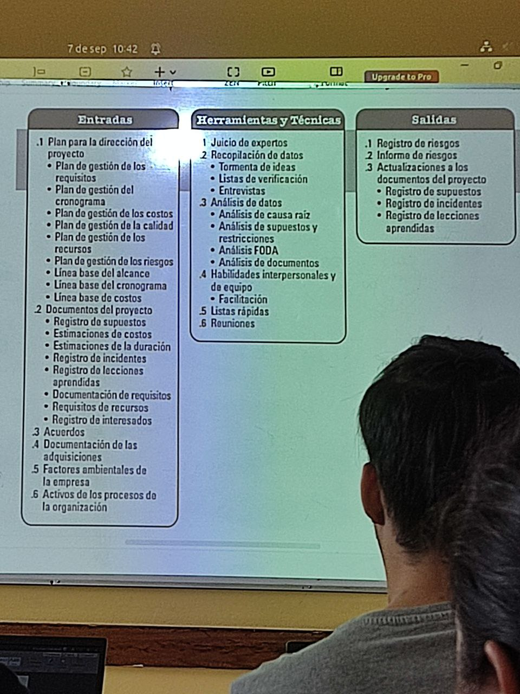

# Gestión de riesgo

Busca el libro de "administración exitosa de proyectos" la edición más actual

Oportunidad: probabilidad de que suceda algo desable

Riesgo: cualquier cosa que puede suceder y puede crear un efecto adverso a nuestro horarios, costo, caliadad o alcance.

Componentes: Pobabilidad de ocurrencia del evento y el impacto o consecuencia de que ocurra.

Categorías riesgos

* tecnicos
* programa
* costo
* Recursos humanos
* externos
* patrocinador-cliente

Gestión riesgo: Todos los procesos para planificar, indentificar, analizar, plan de respuesta y control del riesgo.

Objetivo gestión:

* incrementar probabilidad e impacto d eventos positivos
* decrementar probabilidad e impacto de eventos negativos
* atacar activamente riesgos para incrementar probabilidad exito objetivos.

## Implica

* Identificar
* Evaluar
  * Probabilidad de que riesgo ocurra
  * matriz evaluacion
    * matriz de evaluacion de riesgo
      * riesgo
      * repercusiones
      * pobabilidad de que suceda
      * magnitud de las repercusiones
      * disparador de la accion
      * responsable
      * plan de respuesta
* responder

## Procesos

* Planificar gestion
* identificar riesgos
* realizar analisis
* planificar respuesta
  * DFD
  * Estrategias ante amenazas
    * escalar
    * evitar
    * transferir
    * Mitigar
    * aceptar

## Estrategias mitigación
