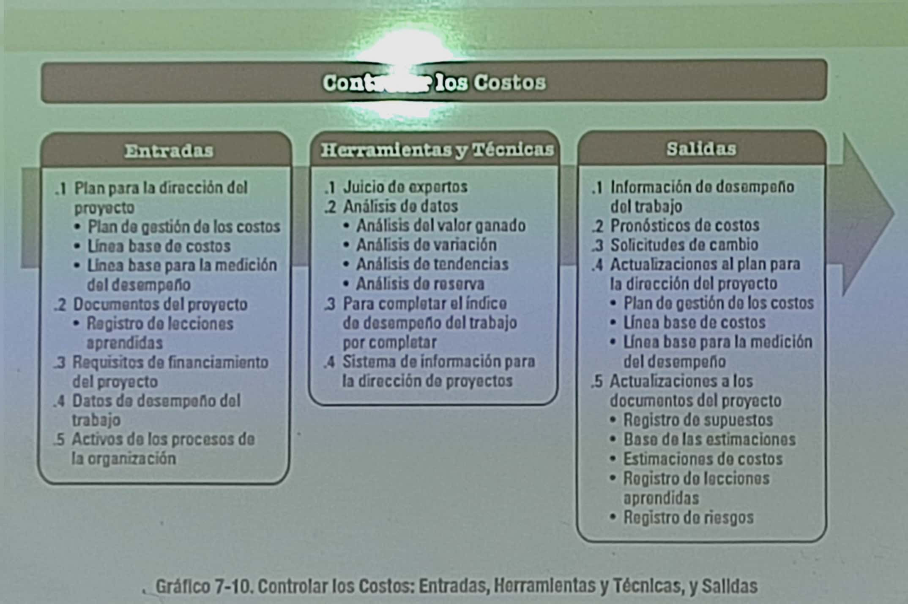
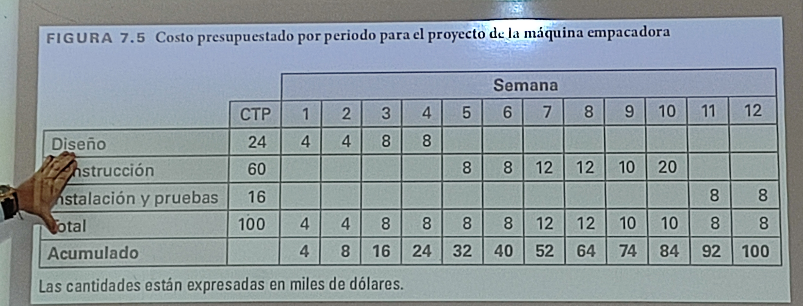
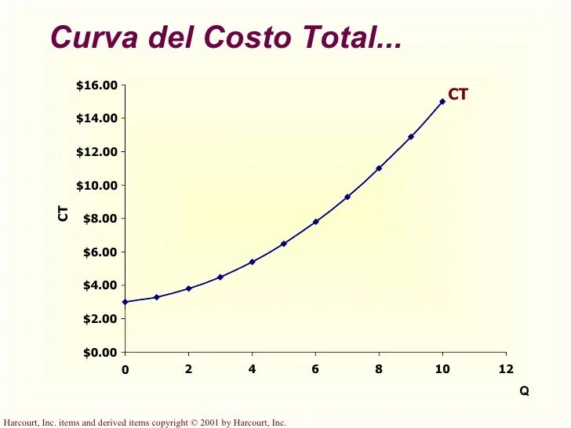

# Gestion de costos

22 agosto 2023

Enunciado del alcance => Costeo del proyecto => Presupuesto - flujo de efectivo

## Tipos de costos

* Mano de obra
* Materiales
* Equipo
* Instalaciones
* Subcontratistas y consultores
* viajes
* contingencias

## Procesos

* Planificar la gestión de los costos
* Estimar los costos
* Determinar el presupuesto
* Controlar los costos

## Planificar la gestion de los costos

* Entradas
  * Acta de contitución del proyecto
  * Plan para la dirección del proyecto
    * Plan de festion del cronograma
    * Plan de gestión de los riesgos
    * Factores ambientales de la empresa
    * Activos de los procesos de la organización
* Herramientas y técnicos
  * Juicio de expertos
  * Análisis de datos
  * Reuniones
* Salidas
  * Plan de gestión de los costos

## Estimar los costos

## Determinar el presupuesto

## Controlar los costos

## CTP Costo total presupuestado

