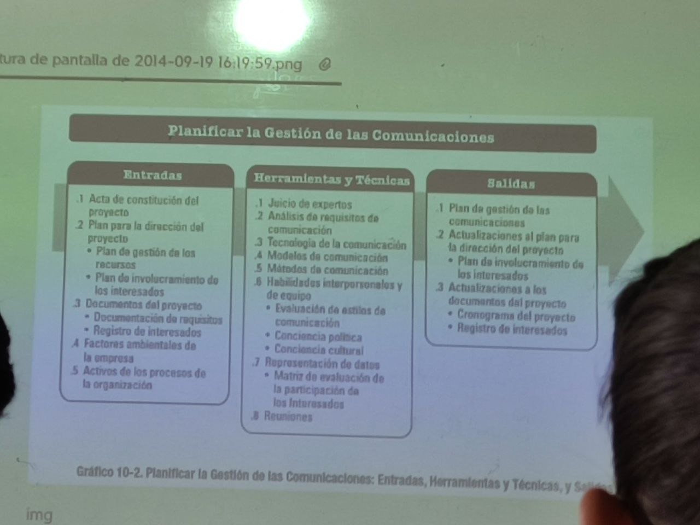
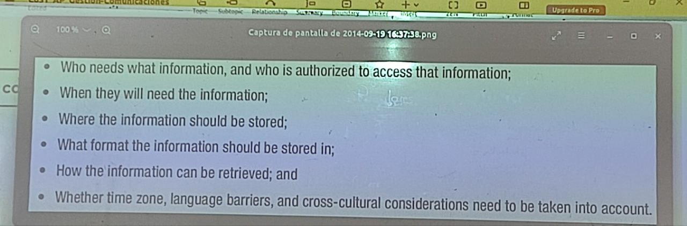
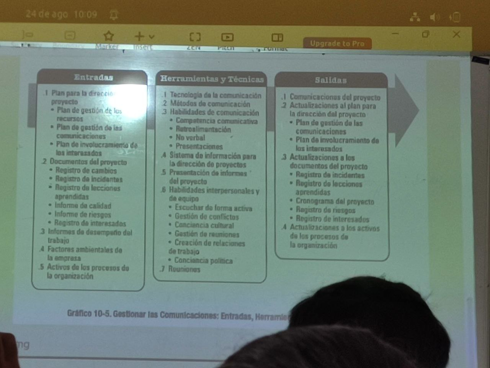
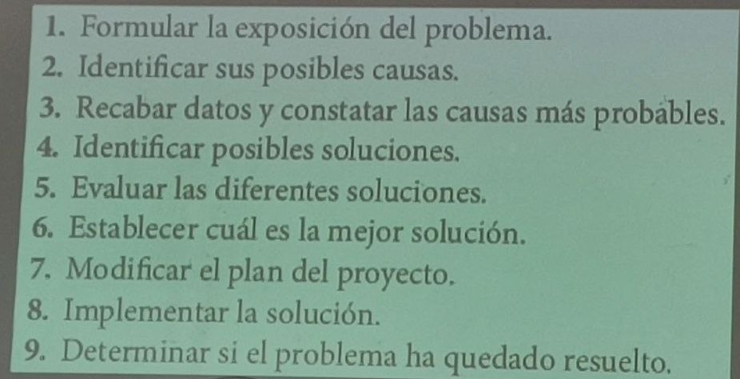

# Gestion de comunicaciones

24/08/2023

## Documentos

Enunciado del alcance => EDT => Cronograma

## Comunicación

intercambio de informacion

Oral o escrita

Lengajes

* verbal
* no verbal (comportamiento)
* corporal

Medios

* Cara a cara
* email, teléfono, carta, memorando

## procesos

## Planificar comunicaciones

por ejemplo, formato para una tabla

* documento
* autor o creador
* fecha o frecuencia de requerimientos
* destinatarios
* accion requerida
* comentarios

Otra informacion

## Gestionar comunicaciones

* Herramienta
  * 
* DFD

## Monitorear las comunicaciones

## Ejemplo plan

* politicas comunicacion
* objetivos
* mensajes a enviar o revibir
* grupos involucrados
* tecnologías o medios
* programa comunicacion

## Reuniones del proyecto

* arranque
* revisar status
* resolver problemas
  * 
* revisar diseño
* evaluacion a posterior

Cada reunión debe tener una agenda

## Reuniones efectivas
